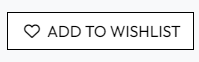

# KICKIN' IT 
[Link to Live Site](https://kickin-it-744f171f0d02.herokuapp.com)

## Mockup


## Introduction

Kickin' It is a full-stack e-commerce web application. The site allows users to browse and purchase high end sneakers online.
Users can create an account, add items to their bag, add items to their wishlist and checkout.
Administrators can add, edit, and delete sneakers to/from the site.

The site has been developed as a part of an educational project, 
my MS4 project for the web application development course @ Code Institute.

This project relies on Stripe for payment processing, however it is only set up for development purposes.

If you wish to test payments, please use the test details:

- Card Number: 4242 4242 4242 4242
- Expiration Date: Any using MM/YY format
- CVC/CVN: Any 3 digits
- Postcode/ZIP: Any 5 digits

Any payments made will not be charged to your account and no orders will be fulfilled.

If you have the relevant log-in details
 for the Django Admin panel, log-in [HERE](https://kickin-it-744f171f0d02.herokuapp.com/admin/)

## Overview

Kickin' It is a full-stack e-commerce web application:

Users can:

- View the store anonymously
- Register for an account
- Wishlist desired products to save for later
- Browse products and sort by Brand, Gender, Price
- Add items to the shopping bag
- Edit and view items in the shopping bag
- View order history if signed in
- Subscribe to the newsletter

The site is available on all web browsers at various screensizes.

## UX

### Target Audience

- Sneaker Collectors
- Gift Givers
- Anyone who wants to buy high end shoes

### Colour Scheme

I opted to not use a main colour scheme for the site, I wanted to keep the design simple, but these were the main colours I used for the site:


Generated via [Coolers](https://coolors.co/)

### Typography

For the main font on the site, I used [Outfit](https://fonts.google.com/specimen/Outfit) from GoogleFonts.

For the text in the Hero, I used [Bebas Neue](https://fonts.google.com/specimen/Bebas+Neue) from GoogleFonts to make that text stand out from the rest.

### Project Goals

#### Site Owner

- Offer a seamless shopping experience
- Provide a user-friendly interface
- Maintain an up-to-date inventory
- Facilitate user engagement via the wishlist and account features

#### External User

- Easily browse and find desired sneakers
- Experience a smooth checkout process
- Personalise the shopping experience through account creation and wishlist functionality

### User Stories

| Role             | User Story Description                                                                                   |
| ---------------- | ------------------------------------------------------------------------------------------------------- |
| Site Visitor/Shopper | I want to be able to search for sneakers by name, brand or descriptor. |
| | I want to add sneakers to my bag to purchase. |
| | I want to be able to create an account so that I can utilise the full features of the website. |
| | I want to be able to filter products by category, gender, brand, price and name. |
| | I want to be given visual feedback when performing actions on the site. |
| Registered Shopper | I want to be able to add products to my wishlist. |
| | I want to be able to checkout securely. |
| | I want to be able to log-in to see my wishlist and account. |
| | I want to be able to view my order history. |
| | I want to be able to subscribe to the newsletter. |
| | I want to save my delivery information to my profile for easy checkout next time I purchase. |
| Admin | I want to be able to add, edit and delete products. |
| | I want to be able to access the admin panel, to manually remove multiple products at once, add categories to the database and overview the website from a "dashboard". |

### User Feedback

"**The website layout is clean and well organised, making it easy for me to find the shoes I was looking for.
Navigating through the site was smooth and I was able to move between categories without any issues. I particularly liked the ‘back to top’ button as this made it easier to go back to the top of the page without the time consuming task of scrolling from the bottom.
The product pages were detailed and clear. The option of adding items to my wishlist was helpful for when I was browsing and was something I could go back to when I was ready to buy something.
The checkout process was simple and hassle-free.
I would suggest adding a ‘quick buy’ button to each product to make the overall shopping experience that little bit faster.**" - Mica Ali

## Features

### Existing Features

<details>
<summary>Click Me</summary>

#### General

| Feature | Description | Image |
|:---|:---|:---|
| Favicon | A favicon to display in the web browser |  |
| Site Logo | Main site title/logo |  |
| Navigation Bar Top | Houses the Search, Account, Wishlist and Bag buttons |  |
| Navigation Bar Bottom | Navbar for product selection |  |
| Search Dropdown | Search through the products on the site |  |
| Profile Dropdown | Drop down menu for account, authentication and product management (admin) |  |
| Products Dropdown (Example: Brands)| Dropdown for further product selection/filtering |  |
| Mobile Nav Bar Top | Navbar for mobile devices | |
| Mobile Nav Bar Bottom | Navbar for mobile devices | |
| Hero | Main hero image featuring shop now call to action button | |
| Featured Products | Showcases the recent featured products, a randomly generate set of 8 of the featured products on each page refresh | |
| Info Cards | States some information and buttons for the website | |
| Top Brands | Shows top brands on the site | |
| Newsletter | An input form to be subscribed to the newsletter | |
| Footer | Footer which is visible on all pages, contains a small navbar for main site pages | |

#### Products Pages

| Feature | Description | Image |
|:---|:---|:---|
| Products Page | Displays all products or filtered search of products | |
| Product Detail Page | Shows a single product | |
| Product Information | Displays product information | |
| Size Selection | Size selection dropdown | |
| Quanitity Selection | Quantity selection with + and - buttons | |
| Add to Bag | Button to add the current product to the bag | |
| Add to Wish List | Button to add the product to the wishlist | |
| Back to Top | Button to return to the top of the page | |

#### Profile

| Feature | Description | Image |
| :---|:---|:---|
| Profile Page | The users profile | |
| Default Information | The users default delivery information, which can be updated here or when an order is placed | |
| Order History | The users order history, where they can view their past orders, including delivery details, price, etc. | |

#### Wishlist

| Feature | Description | Image |
|:---|:---|:---|
| Wishlist Page | The users wishlist | |
| Product | A single product inside the wishlist | |

#### Shopping Bag

| Feature | Description | Image |
|:---|:---|:---|
| Bag Page | The users shopping bag | |
| Product | A single product inside the bag | |
| Summary & Buttons | Two buttons to checkout or continue shopping with a summary of the order costs | |

#### Checkout

| Feature | Description | Image |
|:---|:---|:---|
| Checkout Page | The users secure checkout | |
| Order Confirmation | A confirmation of the order, viewable from the users profile | |

#### Product Management(Admin)

| Feature | Description | Image |
|:---|:---|:---|
| Product Form | A form for creating/editing products | |

#### Newsletter

| Feature | Description | Image |
|:---|:---|:---|
| Newsletter Confirmation Email | Newsletter confirmation email |  |
| Newsletter Unsubscribe | Unsubscribe from the newsletter | |
| Newsletter Unsubscribe Confirmation | Unsubscribe confirmation |  |

</details>

### Future Features

- Stock Levels: Add a feature that allows the admin to set the stock level for each item. And display on the product page when the stock level is low or if the item is out of stock.
- User reviews and ratings: Add a feature that allows users to leave reviews and ratings for each product.
- Quick Buy Button: Add a feature that allows users to quickly add a product to their bag without having to navigate to the product page.
- Blog/Articles: Add weekly articles to the site created by admin, so that users can read the latest news and product drops from the sneaker world.

## Wireframes

For assistance with responsive design, I created wireframes for all breakpoints using [Figma](https://www.figma.com).

These wireframes are very early iterations of the site. Changes were made to better the experience for users.

<details>

<summary>Click Me</summary>

### Landing Page


### Products Page


### Product Detail Page


### Bag Page


### Profile Page


### Login/Register Page


### Checkout Page


</details>

## Structure

### DB

The Django backend is connected to a PostgreSQL database hosted on [AWS](https://aws.amazon.com/).

As Kickin' It tailors to just sneakers, I have changed the product model to add some features to the site.

Below are the custom models for wishlist, newsletter and FAQ sections and updated the updated Product model, which are all custom from the Boutique Ado walkthrough project.

**Product model**

```python
class Product(models.Model):
    category = models.ForeignKey('Category', null=True, blank=True, on_delete=models.SET_NULL)
    sku = models.CharField(max_length=254, null=True, blank=True)
    name = models.CharField(max_length=254)
    description = models.TextField()
    has_sizes = models.BooleanField(default=True, blank=True)
    price = models.DecimalField(max_digits=6, decimal_places=2)
    image_url = models.URLField(max_length=1024, null=True, blank=True)
    image = models.ImageField(null=True, blank=True)
    # Custom fields below
    colourway = models.CharField(max_length=254, null=True, blank=True)
    gender = models.CharField(max_length=254, null=True, blank=True)
    brand = models.CharField(max_length=254, null=True, blank=True)
    release_year = models.IntegerField(null=True, blank=True)
    is_featured = models.BooleanField(default=False, null=True, blank=True)
    is_sale = models.BooleanField(default=False, null=True, blank=True)
    is_new = models.BooleanField(default=False, null=True, blank=True)

```

**FAQ model**

```python
class FAQ(models.Model):
    question = models.CharField(max_length=255)
    answer = models.TextField()
```

**Wishlist model**

```python
class Wishlist(models.Model):
    user_profile = models.ForeignKey(UserProfile, on_delete=models.CASCADE,
                                     null=False, blank=False,
                                     related_name='user_wishlist',
                                     default=None)
    description = models.TextField(null=True, blank=True)
    added_date = models.DateTimeField(auto_now_add=True)
    product = models.ForeignKey(Product, null=False, blank=False,
                                on_delete=models.CASCADE, default=None)
```

**Newsletter model**

```python
class Subscriber(models.Model):
    user = models.OneToOneField(User, on_delete=models.CASCADE, related_name='subscription', null=True, blank=True)
    email = models.EmailField(unique=True)
    date_subscribed = models.DateTimeField(auto_now_add=True)
```

### Databse Schema

For easy visualisation of the database, I used Lucid Chart to build an Entity Relationship Diagram.


### Technology and Languages Used

- HTML
- CSS
- Javascript
- Python
- [Git](https://git-scm.com) for version control
- [Github](https://github.com) to store the codebase
- Gitpod as an online development environment
- [Django](https://www.djangoproject.com) was used as the Python framework
- [Heroku](https://www.heroku.com) to host the application
- [AWS](https://aws.amazon.com) to host the database

Please refer to the [requirements.txt](https://github.com/cambboyle/Kickin-it-v1/blob/main/requirements.txt) file for more information on libraries/frameworks and their versions that were used in the project.

### Testing

For all testing, please refer to the [TESTING.md]() file.

### Deployment

#### Local Deployment

*1. Fork or Clone the repository*

1. Log-in to Github and locate to the [Kickin' It](https://github.com/cambboyle/Kickin-it-v1) repository.

2. From here, either:
   - Clone the repository to your Github
     1. Go to the repository page and click the "Code" button.
     2. Select your preferred method of cloning and copy the url.
     3. In your development environment, run the following command: `git clone https://github.com/cambboyle/Kickin-it-v1`
     4. Once the repository is cloned, navigate to the cloned directory: `cd Kickin-it-v1`
     5. Now in your terminal, you can run the app by running the following command: `python manage.py runserver`
   - Fork the repository by clicking the Fork button on the top right of the repository page.

3. For either option, you will need to install the packages found in the requirements.txt file. In your terminal, run the following command to install the packages:

    ```terminal
    pip3 install -r requirements.txt
    ```

4. Additionally, you will need to set some Environment Variables, you can do this by creating an env.py file at the root directory (Make sure to add this to .gitignore) OR you can set the environment variables in your gitpod environment in your user settings.

    ```python
    import os

    os.environ["SECRET_KEY"] = "your_secret_key"
    os.environ["LOCAL_HOST"] = "your_local_host"
    os.environ["STRIPE_PUBLIC_KEY"] = "your_stripe_public_key"
    os.environ["STRIPE_SECRET_KEY"] = "your_stripe_secret_key"
    os.environ["STRIPE_WH_SECRET"] = "your_stripe_webhook_secret"

    ```

5. Now you need to run the initial migrations and create a "Superuser"

   1. Run the migrations to create the database:

        ```terminal
        python manage.py migrate
        ```

   2. Create a superuser:

        ```terminal
        python manage.py createsuperuser
        ```

6. Now load any fixtures you might have using: `python manage.py loaddata file-name.json`
7. Run your application: `python manage.py runserver`

#### Heroku Deployment

*Setup a PostgreSQL Database*

1. You can setup a postgres database using a web service like AWS, however my project uses a PostgreSQL database from Code Institute and is only available to students.
2. Keep note of the databse URL.

*Heroku Setup*

1. Log in to Heroku and create a new app.
2. Set the name of the app and choose your nearest region.
3. In the app settings, in Config Vars, add the following:

| Key | Value |
| --- | --- |
| `AWS_ACCESS_KEY_ID` | users own value |
| `AWS_SECRET_ACCESS_KEY` | users own value |
| `DATABASE_URL` | users own value |
| `EMAIL_HOST` | users own value |
| `EMAIL_HOST_PASS` | users own value |
| `EMAIL_HOST_USER` | users own value |
| `SECRET_KEY` | users own value |
| `STRIPE_PUBLIC_KEY` | users own value |
| `STRIPE_SECRET_KEY` | users own value |
| `STRIPE_WH_SECRET` | users own value |
| `USE_AWS` | True |

*Configure the DB*

1. In settings.py, set up the database:

  ```python
  import dj_database_url

  DATABASES = {
    'default': dj_database_url.parse(os.environ.get('DATABASE_URL'))
  }
  ```

2. In your terminal, run the following command: `python manage.py showmigrations`, this should show you a list of migrations that aren't checked.
3. Migrate these using the following command: `python manage.py migrate`
4. Create a superuser using the following command: `python manage.py createsuperuser`
5. In your environment variables add: `os.environ[DEVELOPMENT] = "True"`
6. Remove the `DATABASE_URL` from your settings.py file and replace it with this block of code:

    ```python
    if 'DATABASE_URL' in os.environ:
        DATABASES = {
            'default': dj_database_url.parse(os.environ.get('DATABASE_URL'))
        }
    else:
        DATABASES = {
        'default': {
            'ENGINE': 'django.db.backends.sqlite3',
            'NAME': BASE_DIR / 'db.sqlite3',
        }
        }
    ```

7. Finally, push your changes to Github.

*Deploying to Heroku*

Create a Procfile and add the following: `web: gunicorn kickin_it.wsgi:application` with a blank line at the bottom of the file.

For Heroku deployment, you can follow these steps to connect to the new app.

- Select Automatic Deployment from the Heroku App.

Or:

- In the Terminal connect to Heroku using this command: `heroku login -i`
- Set the remote for Heroku: `heroku git:remote -a <your_app_name>`
- After performing the standard Git `add`, `commit`, and `push` to GitHub, you can now type: `git push heroku main`

#### GMAIL Setup

#### AWS Setup

1. **Create an AWS S3 bucket**
   - Log-in to your AWS account, and navigate to the service "S3".
   - Click "Create Bucket", name it the same as your Heroku app, and choose your region.
   - Make sure "Block All Public Access" is unchecked.
   - Create the Bucket.

2. **Enable static website hosting**
   - In the newly created S3 bucket, click on the "Properties" tab.
   - Scroll to Static Website Hosting, click "Edit" and select "Enable".
   - Use 'index.html' as the index file and 'error.html' as the error file.
   - Save your changes

3. **Setup Permissions**
   - In the newly created S3 bucket, click on the "Permissions" tab.
   - Scroll to Bucket Policy, click "Edit".
   - Use the policy generator to create the policy.
     1. Select S3 Bucket.
     2. Use a "*" as the principal.
     3. Set the action to GetObject.
     4. Paste the bucket's ARN, which is at the top of the permissions tab. Add /* to the end to specify all objects.
   - Generate and then copy the new policy, paste it into the Bucket Policy Editor and click save.

4. **Configure the CORS (Cross-Origin Resource Sharing)**
    - In the permission tab, click "CORS".
    - Add the following CORS rules:

        ```json
        [
        {
            "AllowedHeaders": ["Authorization"],
            "AllowedMethods": ["GET"],
            "AllowedOrigins": ["*"],
            "ExposeHeaders": []
        }
        ]
        ```

5. **Set up IAM**
    - Go back to the dashboard and search for IAM.
    - Create a new group in the User Groups section.
    - Go to the Policies tab and create a new policy using the template "S3FullAccess".
    - Customise this policy to this.

        ```json
        {
        "Version": "2012-10-17",
        "Statement": [
            {
            "Effect": "Allow",
            "Action": "s3:*",
            "Resource": [
                "arn:aws:s3:::your-bucket-name",
                "arn:aws:s3:::your-bucket-name/*"
            ]
            }
        ]
        }
        ```

    - Add the new policy to the group.

6. Create an IAM user and assign it the permissions.
   - Users tab, create a new user (select Programmatic Access), and assign the group to the user.
   - Finalise the setup and download the CSV file, this contains your access credentials, keep it safe!

7. Configure Django for AWS
   - In your settings.py file, add the following:

        ```python
        if 'USE_AWS' in os.environ:
            AWS_STORAGE_BUCKET_NAME = 'your-bucket-name'
            AWS_S3_REGION_NAME = 'your-region'
            AWS_ACCESS_KEY_ID = os.environ.get('AWS_ACCESS_KEY_ID')
            AWS_SECRET_ACCESS_KEY = os.environ.get('AWS_SECRET_ACCESS_KEY')
            AWS_S3_CUSTOM_DOMAIN = f'{AWS_STORAGE_BUCKET_NAME}.s3.amazonaws.com'

            # Static and media files configuration
            STATICFILES_STORAGE = 'custom_storages.StaticStorage'
            DEFAULT_FILE_STORAGE = 'custom_storages.MediaStorage'
            STATIC_URL = f'https://{AWS_S3_CUSTOM_DOMAIN}/static/'
            MEDIA_URL = f'https://{AWS_S3_CUSTOM_DOMAIN}/media/'
        ```

8. Custom_Storages
    - In your root folder, create a `custom_storages.py` file.

    ```python
    from django.conf import settings
    from storages.backends.s3boto3 import S3Boto3Storage

    class StaticStorage(S3Boto3Storage):
        location = 'static'

    class MediaStorage(S3Boto3Storage):
        location = 'media'
    ```

9. Configure the Heroku Config Vars that were set up earlier
    - Remember to remove DISABLE_COLLECTSTATIC=1 from the vars
    - Then add the credentials from AWS CSV file to the vars

10. Push to Github
    - You are now safe to commit and push to github, deploy the app from terminal if you have auto deploy disabled in Heroku.
    - Now you can upload the media folder from your local environment to the AWS bucket. (Make sure that public access is enabled in the bucket settings)

#### Stripe Setup

I used Stripe to handle payments on the site.

Create a Stripe account and get logged-in.
    - From the dashboard, copy your Publishable key and your Secret Key. These are your STRIPE_PUBLIC_KEY and STRIPE_SECRET_KEY respectively.

Just in case the user quits the page before the payment has been made, Stripe can include webhooks.
    - From the Developers dropdown, select Webhooks.
    - From the "Webhooks" tab, select "Create new endpoint".
    - Enter your deployed site's URL followed by /checkout/wh/
    - Set the webhook to listen to All Events to ensure you receive all necessary updates.
    - Add the Webhook signing secret to Heroku (STRIPE_WH_SECRET) and your env.py.

#### Setting up gmail and sending emails

I used Gmail to send emails to customers.

I created a new email to handle these.

- In your email account settings, enable 2 factor authentication.
- Create an App Password, you may need to search for it.

Now we need to configure Heroku to handle emails.

In config vars, add the following:

- `EMAIL_HOST` = 'smtp.gmail.com'
- `EMAIL_HOST_USER` = Your email address
- `EMAIL_HOST_PASSWORD` = Your App Password

Now inside your local environment, add these settings to your env.py file:

```python
import os
os.environ.setdefault("EMAIL_HOST", "your-smtp-server")
os.environ.setdefault("EMAIL_HOST_USER", "your-email@example.com")
os.environ.setdefault("EMAIL_HOST_PASSWORD", "your-app-password")
```

### References

https://purepng.com/photo/1717/logos-nike-logo#google_vignette

Icons made by <a href="https://www.flaticon.com/authors/pixel-perfect" title="Pixel perfect">Pixel perfect</a> from <a href="https://www.flaticon.com/" title="Flaticon">www.flaticon.com</a>
Icons made by <a href="https://www.flaticon.com/authors/vectors-tank" title="Vectors Tank">Vectors Tank</a> from <a href="https://www.flaticon.com/" title="Flaticon">www.flaticon.com</a>
Icons made by <a href="https://www.flaticon.com/authors/revolutionizzed-1" title="revolutionizzed_1">revolutionizzed_1</a> from <a href="https://www.flaticon.com/" title="Flaticon">www.flaticon.com</a>

Sneakers icons created by <a href="https://www.flaticon.com/free-icons/sneakers" title="sneakers icons">Nhor Phai - Flaticon</a>

All Sneaker Images are from <a href="https://thesneakerdatabase.com/sneakers" title="sneakers">The Sneaker Database</a>

### Acknowledgements
