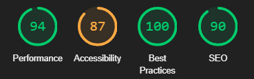
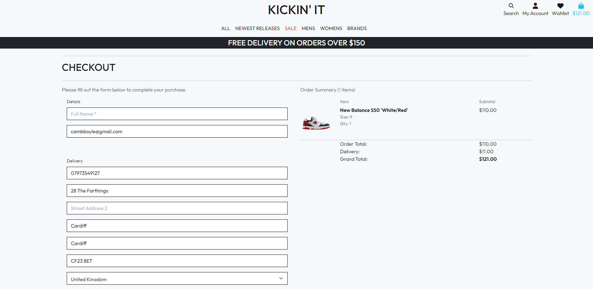

# KICKIN' IT TESTING

Return back to the [README.md](README.md) file.

# Automated Testing

## HTML Validation

For HTML Validation I have used [HTML W3C Validator](https://validator.w3.org/)

All html files that includes Django templating language come back with errors, this is because the Validator does not recognise the Django templating language.

If the validation returns with only django template related errors, I am counting that as a Pass: No Errors.

| Page | Screenshot | Notes | Validation Status |
|:---|:---|:---|:---|
| Home Page |   | | Pass: No Errors |
| Products |  | | Pass: No Errors |
| Add Product |  | | Pass: No Errors |
| Edit Product |  | | Pass: No Errors |
| Product Details |  | | Pass: No Errors |
| FAQ |  | | Pass: No Errors |
| Checkout |  | | Pass: No Errors |
| Checkout Success |  | | Pass: No Errors |
| Bag |  | | Pass: No Errors |
| Wishlist | ! | | Pass: No Errors |
| Newsletter Unsubscribe | | | Pass: No Errors |
| Newsletter  Unsub Confirmation | | | Pass: No Errors |
| Profile | | | Pass: No Errors |

## CSS Validation

For CSS Validation I have used [CSS W3C Validator](https://jigsaw.w3.org/css-validator/)

| Page | Errors/Warnings | Notes | Validation Status |
|:---|:---|:---|:---|
| Base.css | None | | Pass: No Errors |
| Profiles.css | None | | Pass: No Errors |
| Checkout.css | None | | Pass: No Errors |

## JavaScript Validation

For JavaScript Validation I have used [JSHint](https://jshint.com/)

| Page |  Metrics | Warnings | Notes |
|:---|:---|:---|:---|
| stripe_elements.js | There are 5 functions in this file. Function with the largest signature take 1 arguments, while the median is 1. Largest function has 10 statements in it, while the median is 5. The most complex function has a cyclomatic complexity value of 3 while the median is 1. | 2 Warnings for ES6 Template Literal Syntax 1 Warning for a missing semicolon, which has been fixed since. | Undefined Variables of $ all over the file, this is because jshint doesn't recognise JQuery |
| bag.html | There are 3 functions in this file. Function with the largest signature take 1 arguments, while the median is 1. Largest function has 6 statements in it, while the median is 2. The most complex function has a cyclomatic complexity value of 1 while the median is 1. | 1 Warning for ES6 Template Literal Syntax | JQuery Unrecognised |
| products.html | There are 2 functions in this file. Function with the largest signature take 1 arguments, while the median is 0.5. Largest function has 12 statements in it, while the median is 6.5. The most complex function has a cyclomatic complexity value of 2 while the median is 1.5.| No Warnings | JQuery Unrecognised |
| countryfield.js | There is only one function in this file. It takes no arguments. This function contains 4 statements. Cyclomatic complexity number for this function is 2. | "Let" ES6 warning | JQuery Unrecognised |

## Python Validation

For Python Validation I have used the Code Institute [Python Linter](https://pep8ci.herokuapp.com/) Any identifiied issues were fixed.

All .py files in all Apps came back with no errors.

## Lighthouse Testing

I used Googles Lighthouse tool to test the site.

| Page | Mobile | Desktop | Notes |
|:-----|:-------|:--------|:------|
| Home | | | Minor Warnings|
| Products |  | | I think this is because all the products are loaded at once. |
| Profile | | | Minor Warnings |
|Bag | | | Minor Warnings |
| Checkout | | | Minor Warnings |
| Wishlist | | | Minor Warnings |
| Checkout Success |  | | Minor Warnings |
| FAQ |  | | Minor Warnings |
| Newsletter Unsubscribe | | | Minor Warnings |
| Newsletter Unsubscribe Confirmation | | | Minor Warnings |

# Manual Testing

## Browser Compatibility

Kickin' It was tested on the following browsers, with all actions on the site being performed i.e. Add Product, Add To Bag, Checkout.

- Chrome (Development Browser)
- Firefox
- Edge
- Safari
- Opera

## Responsive Design

I used Bootstrap 5.3 for my project, to ensure that all my design were as responsive as possible. I regularly tested responsiveness during development

I did have to make changes for SM and XS screens on a lot of pages, to make the information displayed smaller so it took up less screen space.

Responsive Design

*Landing Page*

| Device     | Screenshot | Notes |
|:-----------|:-----------|:------|
| Default |  | Works as intended |
| LG |  | Works as intended |
| MD |  | Works as intended |
| SM |  | Works as intended |
| XS |  | Works as intended |
| 4K |  | Noticable Scaling Issues |

*Products Page*

| Device     | Screenshot | Notes |
|:-----------|:-----------|:------|
| Default |  | Works as intended |
| LG |  | Works as intended |
| MD |  | Works as intended |
| SM |  | Works as intended |
| XS |  | Works as intended |
| 4K |  | Noticable Scaling Issues |

*Checkout Page*

| Device     | Screenshot | Notes |
|:-----------|:-----------|:------|
| Default |  | Works as intended |
| LG |  | Works as intended |
| MD |  | Works as intended |
| SM |  | Works as intended |
| XS |  | Works as intended |
| 4K |  | Noticable Scaling Issues |

## User Story Testing

User Story Testing

| Role | Description | Screenshot |
| :--- | :--- | :--- |
| Site Visitor/Shopper | I want to be able to search for sneakers by name, brand or descriptor.           |  |
|| I want to add sneakers to my bag to purchase. |  |
|| I want to be able to create an account so that I can utilise the full features of the website. |  |
|| I want to be able to filter products by category, gender, brand, price and name.  |  |
|| I want to be given visual feedback when performing actions on the site.| |
| Registered Shopper | I want to be able to add products to my wishlist. |  |
| | I want to be able to checkout securely.  |  |
|| I want to be able to log-in to see my wishlist and account.|  |
|| I want to be able to view my order history.|  |
|| I want to be able to subscribe to the newsletter.|  |
|| I want to save my delivery information to my profile for easy checkout next time I purchase. |  |
| Admin | I want to be able to add, edit and delete products. |  |
|| I want to be able to access the admin panel, to manually remove multiple products at once, add categories to the database and overview the website from a "dashboard". |  |

## User Input / Form Validation

User Input/Form Validation

| Page | Action | Expected | Actual | Pass/Fail | Feedback to User |
|:-----|:-------|:---------|:-------|:----------|:-----------|
| Navbar Top Buttons | Click | User clicks the button and the button is activated | User clicks the button and the button is activated | Pass | The user is redirected to the clicked page |
| Button Hover | Hover | User hovers over the button and the button is activated | User hovers over the button and the button is activated | Pass | Button changes styles |
| Search Bar | Input | User enters text in the search bar and their query is returned | User enters text in the search bar and their query is returned | Pass | User is redirected to products page and their query is shown |
| Navbar Bottom Buttons | Click | User clicks the button and the button is activated | User clicks the button and the button is activated | Pass | User is redirected to the clicked page |
| Navbar Bottom Dropdown on Hover | Hover | User hovers over the dropdown and the dropdown is activated | User hovers over the dropdown and the dropdown is activated | Pass | User can see the dropdown menu and interact with it |
| Newsletter Email Input | Input | User enters text in the newsletter email field and an email is sent to the user | User enters text in the newsletter email field and an email is sent to the user | Pass | User recieves an email from the newsletter |
| Profile Information Update | Input | User updates their profile information and it is saved to their profile | User updates their profile information and it is saved to their profile | Pass | Toast message is displayed |
| Log-in page | Input | User enters their email and password and they are logged in | User enters their email and password and they are logged in | Pass | Toast message is displayed and user can see their profile and wishlist |
| Log-out | Click | User clicks the log-out button and they are logged out | User clicks the log-out button and they are logged out | Pass | Toast message is displayed |
|Product Add to Bag | Click | User clicks the add to bag button and the product is added to their bag | User clicks the add to bag button and the product is added to their bag | Pass | Toast message is displayed with updated bag |
| Product Add to Wishlist | Click | User clicks the add to wishlist button and the product is added to their wishlist | User clicks the add to wishlist button and the product is added to their wishlist | Pass | Toast message is displayed with updated wishlist |
| Product Remove from Bag | Click | User clicks the remove from bag button and the product is removed from their bag | User clicks the remove from bag button and the product is removed from their bag | Pass | Toast message is displayed with updated bag |
| Product Remove from Wishlist | Click | User clicks the remove from wishlist button and the product is removed from their wishlist | User clicks the remove from wishlist button and the product is removed from their wishlist | Pass | Toast message is displayed with updated wishlist |
| Checkout Securely button | Click | User clicks the checkout securely button and they are redirected to the payment page | User clicks the checkout securely button and they are redirected to the payment page | Pass | User is redirected to the payment page |
| Keep Shopping button | Click | User clicks the keep shopping button and they are redirected to the products page | User clicks the keep shopping button and they are redirected to the products page | Pass | User is redirected to the products page |
| Back to bag button | Click | User clicks the back to bag button and they are redirected to the bag page | User clicks the back to bag button and they are redirected to the bag page | Pass | User is redirected to the bag page |
| Confirm Order button | Click | User clicks the confirm order button and they are redirected to the order confirmation page | User clicks the confirm order button and they are redirected to the order confirmation page | Pass | User is redirected to the order confirmation page and they are sent an email with their order details, also toast message is displayed and info and order are saved to users profile |
| FAQ link | Click | User clicks the faq link and they are redirected to the faq page | User clicks the faq link and they are redirected to the faq page | Pass | User is redirected to the faq page |
| Product Quantity - Product View | Input | User can change the quantity of the item | User can change the quantity of the item | Pass | Number in input field is dynamically updated |
| Product Quantity - Bag View | Input | User can change the quantity of the item in the bag | User can change the quantity of the item in the bag| Pass | Page is reloaded and bag quantity is updated |
| Product Size | Select | User can select the size of the item | User can select the size of the item | Pass | Size is dynamically updated |
| Add Product (Admin) | Click | Admin can add a product via the form | Admin can add a product via the form | Pass | Product is added to database, toast message is displayed |
| Edit Product (Admin) | Click | Admin can edit a product via the form | Admin can edit a product via the form | Pass | Product is updated in database, toast message is displayed |
| Delete Product - Product Details Page (Admin) | Click | Admin can delete a product | Admin can delete a product | Pass | Product is deleted from database, toast message is displayed |
| Delete Product - Products Page (Admin) | Click | Admin can delete a product | Admin can delete a product | Pass | Product is deleted from database, toast message is displayed |

## Bugs

There are no known bugs with Kickin' It.
